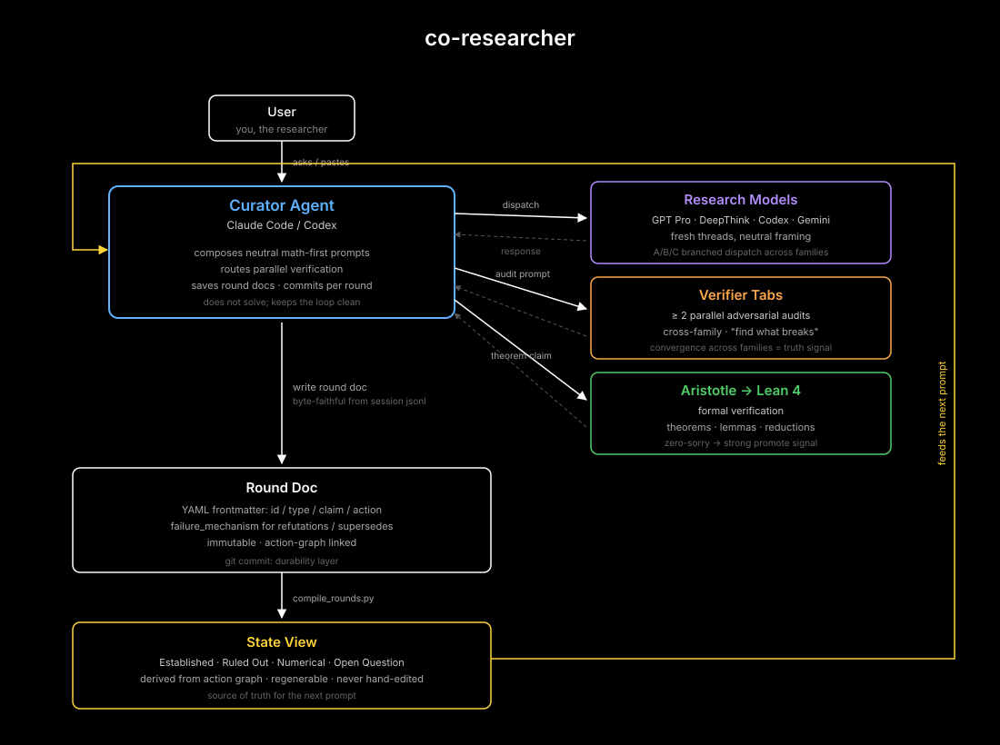

Hi, I'm Om Buddhdev (https://www.sensho.xyz/). This is where my personal work on research problems lives. If you see issues with any of the work or claims, please feel free to email sensho@sensho.xyz or DM on X @sensho, I'll try my best to update or fix accordingly.

If you'd like to replicate a similar setup, an agent co-researcher for personal use is at: [erdos-co-researcher](https://github.com/xa8zz/erdos-co-researcher). Feel free to clone it and run the `/onboard` skill with any file tree based agent (Claude Code, Codex, etc.)

Problem relevant content at:
- `<problem>/` — round docs (researcher outputs, verifier audits, followups)
- `<problem>/prompts/` — dispatch prompts sent to the research models
- `<problem>/paper/` — the writeup
- `<problem>/lean/` — formal verification via Aristotle → Lean 4
- `<problem>/phase*/` — empirical probes and numerical evidence

I primarily use this with Claude Code as the main co-researcher with Codex as a secondary co-researcher for more technical work like proving in lean. Claude is better at prompting and has 1M context available on Claude Code Max to be able to help synthesize over large amounts of compiled frontmatter from rounds and use prompt skills to synthesize/strategize with you.

How co-researcher works:

License: MIT for code, CC-BY 4.0 for research artifacts.

## Current Erdős #872 result

**Result (announced 2026-07-24): L(n) = o(n)** — a claimed proof that the
divisor-antichain saturation game has sublinear guaranteed length, so it
cannot be guaranteed to last εn moves for any fixed ε > 0. This answers two
of the three questions Erdős asked (at least εn moves? at least (1−ε)n/2
moves? — both no, under the Prolonger-moves-first convention); Erdős's
remaining question — the true order of L(n) — stays open, with the best
known lower bound the rank-three note linked below. The claim was submitted
to [erdosproblems.com](https://www.erdosproblems.com/forum/thread/872/proof-claims)
on 2026-07-30 and is under community audit; the
[problem page](https://www.erdosproblems.com/872) lists #872 as open
pending that review. The manuscript is
[researcher-R179-lean-verified-manuscript.md](erdos-872/researcher-R179-lean-verified-manuscript.md)
(robust envelope game with an erasure ally, self-rough quotient cones,
Shortener's root-cone sweep, and the density recursion c_b ≤ c_{b+1}/2
forcing c_1 = 0). Archived and citable — manuscript preprint:
DOI [10.5281/zenodo.21545919](https://doi.org/10.5281/zenodo.21545919);
research record + Lean formalization (release
[v1.0-r179](https://github.com/xa8zz/erdos-harness/releases/tag/v1.0-r179)):
DOI [10.5281/zenodo.21545890](https://doi.org/10.5281/zenodo.21545890)
(concept DOI tracking all versions:
[10.5281/zenodo.21545889](https://doi.org/10.5281/zenodo.21545889)).

**Verification status — read before citing:**

- Blind adversarial referee (fresh model context, itemized checklist over
  every load-bearing joint): **accept after minor fixes, no fatal flaw** —
  [report](erdos-872/fable/audit-R176-referee-raw.md). All mandated repairs
  are implemented and diff-audited:
  [V177](erdos-872/verify-R177-fable-audit.md).
- Machine checks of the discrete skeleton (cone disjointness/covering, the
  arithmetic decomposition, the packet instance, a real-rules strategy smoke
  test) pass — see the [worklog](erdos-872/fable-worklog-R172.md).
- **Formal Lean 4 verification: axiom-free for the encoded Prolonger-first
  theorem on current `main`.** `Erdos872.main` (sublinearity of the
  Prolonger-first game value) builds with zero tracked `sorry`, `admit`,
  `native_decide`, or `unsafe`; the final kernel query reports only Lean's
  standard classical axioms `[propext, Classical.choice, Quot.sound]`.
  `A3_exceptional_set_estimate` is now a theorem with the identical signature
  formerly assumed, and the two unused analytic axiom declarations were
  deleted. See the [A3 formalization report](erdos-872/lean/r177_verification/A3_FORMALIZATION_REPORT.md)
  and project `erdos-872/lean/r177_verification/`. The independent
  [V181](erdos-872/verify-lean-R179-fable-kernel-check.md) report remains the
  audit of the earlier one-axiom checkpoint, not the current axiom report.
  This artifact does **not** formalize the Shortener-first variant or settle
  the sharp asymptotic rate; canonical-source correspondence and independent
  rebuild review remain separate evidence gates.
- Cross-model-family audit: pending.

Earlier milestone: the
[unconditional rank-three lower-bound note](erdos-872/RESULT_UNCONDITIONAL_RANK_THREE.md).
The July-10 draft in `erdos-872/paper/` proves the pre-solution bounds
(L(n) < 0.19n) and predates the o(n) manuscript; it is kept as a historical
artifact until the paper is rewritten around the new result.
